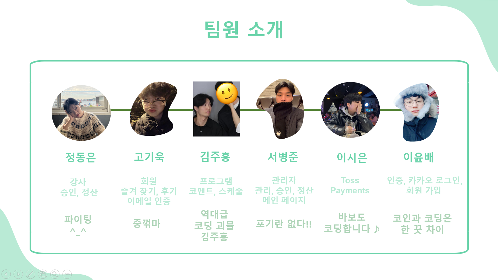
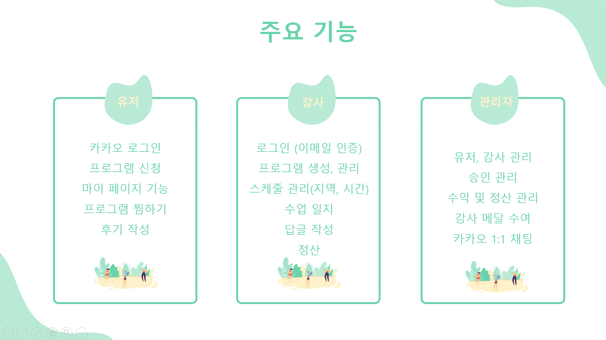
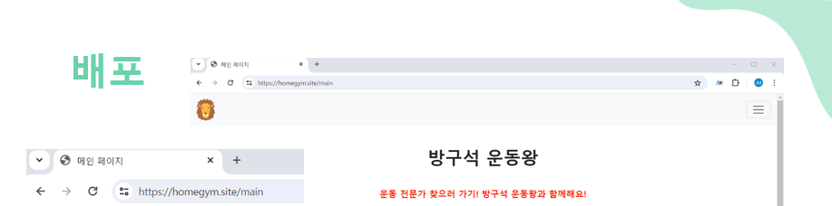

## 📝전문가 방문 PT 서비스 만들기
외출이 제한되는 노인, 임산부, 바쁜 직장인들을 위해 운동 전문가가 직접 가정에 방문하여 건강하고 꾸준한 운동습관을 만들어주는 고객 맞춤형 방문 PT를 제공해 주는 서비스입니다.

## 스택 ⚙
* Spting Boot 3.2.1
* Spring Data JPA
* Spring Security
* Jwt
* Oauth2
* Nginx
* CertBot
* Thymeleaf
* MySql
* Docker
* Redis
* AWS EC2
* NCP (네이버 클라우드 플랫폼)

## 팀원 및 파트 분배 🙋



## 주요 기능 


## ERD


## 담당한 기능 정리 💻
`/main` 메인페이지 <br>
> * 인기 강사 - 강사의 상태가 ACTIVE이고, 메달이 Gold인 강사들 중에서 랜덤으로 3명 가져오기 <br>
> * 회원 후기 - 별점이 5점인 리뷰만 가져와서 보여주기 (Pageable 사용)
>```java
>    // Pageable 사용하기
>    @Transactional
>    public Page<Review> findAllStarIsFive(int page, int pageSize){
>        Pageable pageable = PageRequest.of(page, pageSize, Sort.by("id").descending()); // id를 기준으로 역순으로 정렬
>        return reviewRepository.findAllStarIsFive(pageable);
>    }
>```
`/admin` 관리자 메인 페이지 <br>
> * 유저 목록 - 서비스를 이용중인 모든 유저를 보여주고 유저의 이름, 이메일, 성별, 상태를 알려준다 <br>
> * 강사 목록 - 서비스를 이용중인 모든 강사를 보여주고 강사의 이름, 이메일, 전화번호, 성별, 상태를 알려준다 <br>

`/admin/user/{userId}` 유저 상세 페이지 <br>
> * 유저가 수강 중인 수업을 전부 볼 수 있다<br>
> * 전액환불, 회차환불, 수정하기 버튼 만들어주기
> * 전액 환불 - 유저 프로그램의 `state`를 환불 상태(CANCEL)로 바꿔준다 <br>
> * 회차 환불 - 결제 금액에서 1회당 금액을 계산하여 환불해주고, `state`와 `LocalDateTime`을 수정해준다     
>```java
>    public void refund(Long userProgramId){
>        UserProgram userProgram = userProgramRepository.findById(userProgramId).orElseThrow();
>        // 프로그램 결제 금액
>        int amount = userProgram.getAmount(); 
>        int maxCount = userProgram.getMaxCount(); //최종 회차
>        int count = userProgram.getCount(); // 진행 중인 회차 
>        // 1회당 금액
>        int result = amount/maxCount;
>        // 진행 횟수에 따른 환불 금액
>        result = result * count;
>        userProgram.setAmount(result);
>        userProgram.setState(UserProgram.UserProgramState.FINISH);
>        userProgram.setEndTime(LocalDateTime.now());
>        userProgramRepository.save(userProgram);
>        UserProgramDto.fromEntity(userProgram);
>    }
>```
> * 수정하기 - 유저 프로그램의 `count`를 입력한 숫자로 수정해준다<br>

`/admin/instructor/{instructorId}` 강사 상세 페이지 <br>
> 강사가 수강 중인 수업을 전부 볼 수 있다 <br>
> 강사가 모든 프로그램으로부터 벌이들인 총 금액을 볼 수 있다 <br>
> 강사가 각 각의 프로그램으로 벌어들인 총 수익, 이번 달 수익을 볼 수 있다 <br>
> 강사에게 메달을 수여할 수 있다 <br>
> * 메달 수여하기 - Gold, Sliver, Bronze, Unranked 버튼을 눌러서 메달 수여
> ```java
>   // 하나의 form요소에서 '여러가지 input btn'에 대하여 선택한 btn의 값 보내기
>     <form class="d-flex align-items-center justify-content-between" th:action="@{'/admin/instructor/'+${instructor.id}+'/medal'} " method="post">
>         <p class="mb-0 d-flex align-items-center justify-content-between">
>           <code>메달 수여하기</code><a class="me-2"></a>
>             <input type="submit" class="btn btn-warning" value="Gold" name="Gold"><a class="me-1"></a>
>             <input type="submit" class="btn btn-secondary" value="Silver" name="Silver"><a class="me-1"></a>
>             <input type="submit" class="btn btn-brown" value="Bronze" name="Bronze"><a class="me-1"></a>
>             <input type="submit" class="btn btn-primary" value="Unranked" name="Unranked"><a class="me-1"></a>
>         </p>
>     </form>
>     
>   // URL을 통해 보낸 값을 Controller에서 받아주는 방법      
>     @PostMapping("/{instructorId}/medal")
>        public String medal(
>           @PathVariable("instructorId")
>              Long instructorId,
>              @RequestParam(value = "Gold", required = false) String Gold,
>              @RequestParam(value = "Silver", required = false) String Silver,
>              @RequestParam(value = "Bronze", required = false) String Bronze,
>              @RequestParam(value = "Unranked", required = false) String Unranked
>        )
>```
> #### 금액 표기하기
> * 금액 표기하기 - 가독성 향상을 위해 `Integer`로 선언된 값을 프론트에서 1000단위 마다 콤마 찍어주기 ex) 50000 -> 50,000 <br>
> * 금액 표기하기 - `NumberUtils`클래스를 만들어서 사용 / 단, 콤마(,)는 문자열이기 때문에 String타입에 저장 
> ```java
>   // 금액 표기하기
>     @Component
>       public class NumberUtils {
>          public String addCommasToNumber(int number) {
>            DecimalFormat formatter = new DecimalFormat("#,###");
>            return formatter.format(number);
>          }
>       }
>```
            
`/admin/instructor/accept` 강사 승인 페이지 <br>
> 강사의 `state`가 신청 대기 중(REGISTRATION_PENDING)인 강사를 모두 가져오고, 승인, 거절 버튼 만들어주기 <br>
> * 승인 - 강사의 `roles`를 ROLE_INSTRUCTOR로 바꿔주고, `state`를 ACTIVE로 바꿔준다 <br>
> * 거절 - DB에서 데이터 삭제 <br>

`/admin/instructor/withdraw` 강사 회원 탈퇴 페이지 <br>
> 강사의 `state`가 탈퇴 대기 중(WITHDRAWAL_PENDING)인 강사를 모두 가져오고, 탈퇴 사유 및 승인, 거절 버튼 만들어주기 <br>
> * 승인 - 강사의 `state`를 탈퇴 완료된 강사(WITHDRAWAL_COMPLETE)로 바꿔준다 <br>
> * 거절 - DB에서 삭제되는 것이 아닌, 강사의 데이터 유지 <br>

`/admin/program/creation` 프로그램 신청 페이지 <br>
> 프로그램의 `state`가 생성 대기 중(CREATION_PENDING)인 프로그램을 모두 가져오고, 강사가 어떤 프로그램을 신청했는지 알 수 있다 <br>
> 프로그램 수락하기, 거절하기 버튼 만들어주기 <br>
> * 수락하기 - 프로그림의 `state`를 프로그램 진행 중(IN_PROGRESS)으로 바꿔준다 <br>
> * 거절하기 - DB에서 데이터 삭제 <br>

`/admin/program/modification` 프로그램 수정 페이지 <br>
> 프로그램의 `state`가 수정 대기 중(MODIFICATION_PENDING)인 프로그램을 모두 가져오고, 수정하기 버튼 만들어주기 <br>
> * 수정하기 - 프로그램의 `state`를 프로그램 진행 중(IN_PROGRESS)으로 바꿔준다 <br>

`/admin/program/deletion` 프로그램 삭제 페이지 <br>
> 프로그램의 `state`가 삭제 대기 중(DELETION_PENDING)인 프로그램을 모두 가져오고, 삭제하기 버튼 만들어주기 <br>
> * 삭제하기 - 프로그램의 `state`를 프로그램 삭제 완료(DELETION_COMPLETE)로 바꿔준다 <br>

`/admin/settlement` 정산하기 <br>
> 강사의 정산 신청 금액과 정산 신청 날짜를 보여주고, 정산하기를 클릭하면 정산 완료로 바꿔준다<br>
> * 정산하기 - `SettlementState`를 정산 대기 중(SETTLEMENT_PENDING)에서 정산 완료(COMPLETE)로 바꿔준다.
> * 금액 표기하기 - [이동하기](#금액-표기하기)
> * 날짜 표기하기 - 가독성 향상을 위해 `LocalDateTime`로 선언된 값을 프론트에서 yyyy-mm-dd로 만들어주기  
>```java
>   // 날짜를 yyyy-mm-dd 모습으로 바꿔주기 ex) 2024-05-23 16:33:12.000000 -> 2024-05-23  
>     DateTimeFormatter formatter = DateTimeFormatter.ofPattern("yyyy-MM-dd");
>       log.info("GetCompleteTime 수정 전 : {} ", settlement.getCompleteTime()); // 2024-05-23 16:33:12.000000
>       String dateCompleteTime = settlement.getCompleteTime().format(formatter);
>
>       log.info("GetCompleteTime 수정 후 : {} ", dateCompleteTime); // 2024-05-23
>       settlement.setDateCompleteTime(dateCompleteTime);
>```

관리자 페이지의 프론트는 `반응형 웹 템플릿`을 이용하였다

## 배포 과정 간략히 보기 👀
[여기를 눌러 주세요](https://github.com/mad-cost/Likelion_team5/blob/main/md/homeGym.md "Click")

### HTTPS 적용 성공!! 🙆


## 회고 🤔
드디어 두 번째 팀 프로젝트가 끝이 났다 (스스로에게 박수를)👏👏👏 이번 프로젝트에서는 `관리자 페이지`를 만들게 되었다.<br>
이번 프로젝트에서는 새로운 시도를 많이 했던 것 같다. <br>

반응형 웹 사이트를 써보기도 하고, 페이지를 넘기는 Pageable기능, html에서 하나의 form요소에 대하여 여러 개의 input btn이 있을 때 선택한 btn의 값을 Controller에서 어떻게 처리하는지에 대한 방법, 1000단위 숫자마다 금액에 콤마(,)를 찍어주는 클래스, LocalDateTime으로 선언된 값을 프론트에서 가독성을 높여주기 위해 바꿔주는 등.. 많은 시도를 했었지만 `가장 뿌듯한 성과`는 `배포`를 직접 해보고 `도메인, 클라우드를 구입`하여 `HTTPS`까지 적용을 했다는 것이 가장 큰 성과가 아닐까 생각한다 😎 <br>

`어려웠던 점`으로는 관리자 페이지는 유저와 강사 페이지를 다 완성하고 만드는 것이 아닌, 앞선 각 파트(유저 및 강사)를 맡은 팀원이 어떤 방식으로 로직을 짜고 만들지 예상을 하면서 만들어야 한다는 것이 생각보다 나의 머리를 아프게 만들었다. 다시 말해 다른 팀원들과 더 많은 의사소통을 요구한다는 뜻이기도 하다. 그만큼 팀원들의 성격을 빨리 파악할 수 있고, 팀의 분위기를 내가 먼저 리드하고 함께 만들어 갈 수 있어서 좋았다👍 첫 번째 프로젝트에서는 Jwt 방식을 사용한 Oauth로그인을 맡았기 때문에 이번 프로젝트는 로그인이 아닌 다른 파트를 맡게 되어서 많은 경험이 된 것 같다. 그리고 배포를 하면서 `aws ec2에서 자꾸 멈추는 현상이 발생`하였다. 이 문제를 해결하기 위해 ubuntu화면 프리징 현상, aws ec2멈춤 현상 혹은 배포 과정 중에 잘못된 부분이 있는건 아닌지(?) 등.. 2일을 소모했는데 알고보니 문제가 도커에서 컨테이너 3개를 동시에 실행시켜서, ec2 프리티어가 용량을 감당하지 못해 뻑(?)나는 문제였다. 이 문제를 해결하기 위해 클라우드를 aws에서 ncp(네이버 클라우드 플랫폼)으로 바꾸게 되었고 첫 회원가입시 10만 크레딧을 지급해 주기 때문에 이 문제는 해결되었다. 해결책이 너무 단순해서 약간의 허무함과 허탈함을 느끼기도 하였지만 그래도 해결했다는 생각에 기분은 더없이 좋았다. <br>

`기억에 남는 기능`으로는 `Pageable`이 생각이 난다. 저번 프로젝트 때 `검색 기능`을 만들어 보기도 했고, 사실 프론트에서 클릭 몇 번이면 동작하는게 Pageable 기능이기 때문에 당연히 금방 할 줄 알고 만만하게 생각하였지만! 생각보다 시간을 너무 많이 소모하였다ㅠㅜ.. <br>

이번 프로젝트를 마치면서 `공부하고 싶은 기능`들이 생겼는데 1.Query문을 더 익숙하게 사용하는 것, 2.Redis기능 공부하기였다. 팀원 중에 이메일 중복을 검사하고 Redis를 이용하여 검증된 이메일로 임시 비밀번호를 발급해 주는 기능을 만들었는데 상당히 재밌어 보였기 때문이다. <br>

`마무리` 이번 프로젝트를 자양분 삼아 한층 더 성장하고 앞으로 나아가는 개발자가 된거 같다. 앞으로도 파이팅!! 🏊‍♀️ 


